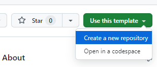

# Rick & Morty App - TDSOFT Frontend Developer Recruitment Task
###### 2024

# How to submit your solution 📨
1. Create own version of repository using Github [Template repository](https://docs.github.com/en/repositories/creating-and-managing-repositories/creating-a-repository-from-a-template)
   
2. Work on the task in separate branch
3. Once you're done, create a pull request to the `main` branch of your repository and share it with us.

## About codebase 🔎
This recruitment assignment is designed to test your React knowledge and ability to complete a given task by adding new features to the "real", existing codebase. This application uses CSS-in-JS for styling and the React-context API for state management.
As you start the project you will see first version of the "Rick & Morty widget" - a dead simple widget showing some basic data about characters from the show.

As a Frontend Developer, your task is to create version 2 of this very widget. 
You have received the Figma project file and some work including rendering Rick Sanchez's information has already been done.

# The Task 👨‍💻

- Make a pixel-perfect match with new designs and pick required values from the Rick & Morty API

- Integrate the "Previous" and "Next" buttons. Once clicked they should fetch and render previous (-1) or next (+1) characters from the Rick & Morty API

- Integrate "Alive" / "Dead" / "unknown" variants. They should be based on the "status" field from the API

- The "episodes" label value should be computed (sum) from the "episode" field from the API

...in case you wonder - yes, you can refactor everything as you wish, we want to have a product that meets the criteria but it's also well written. This sandbox is entirely yours - do your magic 🪄

## Resources 📚

- Figma project file: https://www.figma.com/file/HYf7stAEUjneRXpgG8xVL0/Rick-and-Morty-Widget
- Rick & Morty API documentation: https://rickandmortyapi.com/documentation/#rest
- EmotionJS documentation: https://emotion.sh

## Bonus points 💯

here are some things you can do if you feel like 😇 (but these are not obligatory). You can still impress us by doing a bare minimum 👍

- Protect the app from fetching characters ids that are out of range (non-existing) (Tip: The range of character identifiers is specified in the documentation: https://rickandmortyapi.com/documentation/#character)
- Re-using colors declarations (possibly with a constant/enum or even with "theming")
- Introduce the "loading state" as designed: https://www.figma.com/file/HYf7stAEUjneRXpgG8xVL0/Rick-and-Morty-Widget?node-id=2%3A76
- Handle possible network / API errors with the "error state" as designed: https://www.figma.com/file/HYf7stAEUjneRXpgG8xVL0/Rick-and-Morty-Widget?node-id=2%3A101

## Disclosure ⛔️

Please do not share the contents of this task publicly nor with others.

## Feedback 💬

We'd love to hear your thoughts about this assignment. Feel free to submit your feedback in the FEEDBACK.md file at the root of this repository.

## Questions 🙋

If you have any issues or questions feel free to contact us directly at:

- michal.pietrzyk@tdsoft.com
- nikodem.nowak@tdsoft.com
- dariusz.kobuszewski@tdsoft.com
